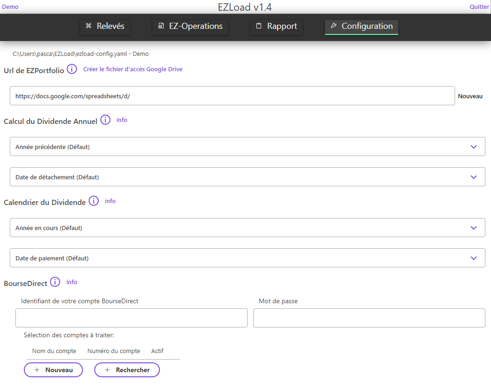
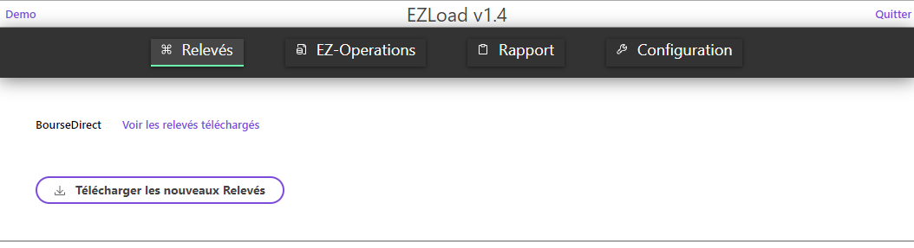
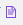
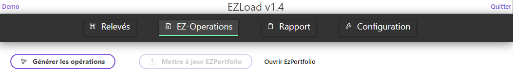
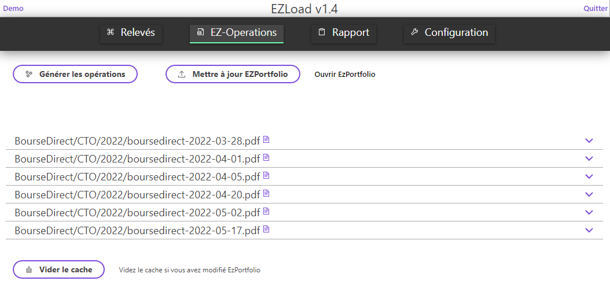
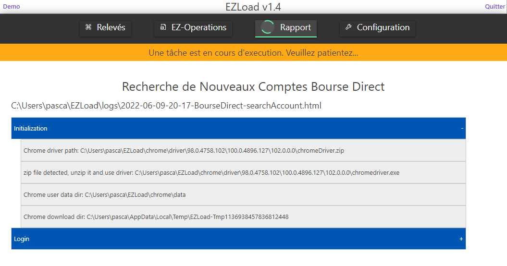
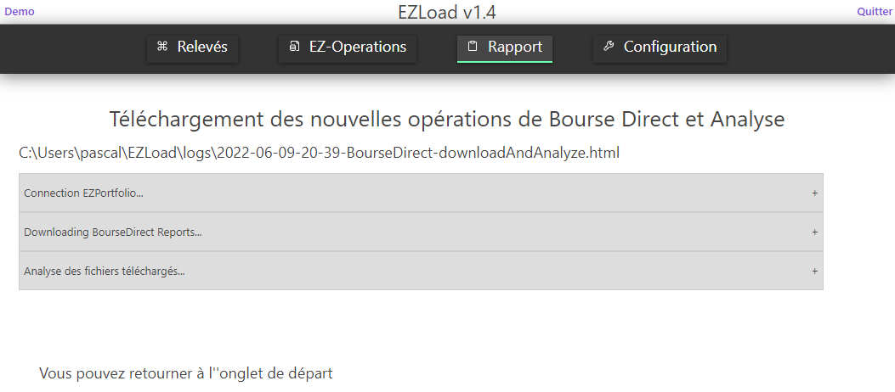
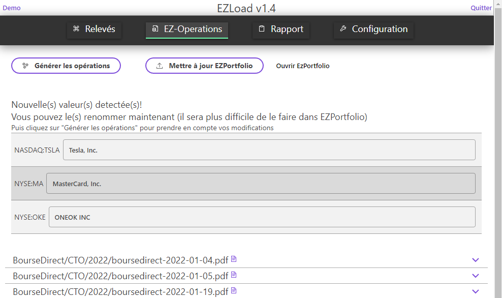
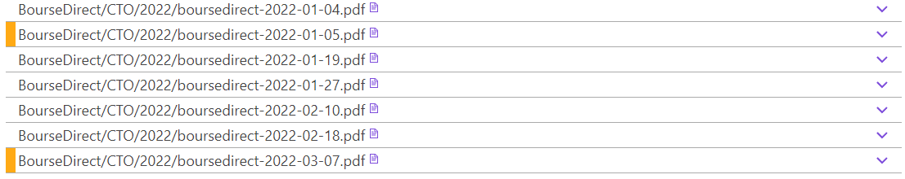
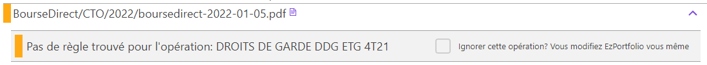

# EZLoad 

Ce logiciel nécessite d'avoir accès a [EZPortfolio](https://revenusetdividendes.com/logiciel-suivi-portefeuille-bourse-ezportfolio/)

* [Installation](#Install)
* [Configuration](#Config)
* [Configuration](#Config)
* [Etape 1 - Télécharger les relevés d'information](#Step1)
* [Etape 2 - Générer les opérations](#Step2)
  * [Nouvelle Valeur détecté](#GenOpNewShare)
  * [Opération inconnue](#GenOpUnknown)
  * [Autre erreur](#GenOpCrash)
* [Etape 3 - Mettre à jour EZPortfolio](#Step3)
* [Tâche en cours](#CurrentTask)

## Installation
* Nécessite l'installation de [Java](https://www.oracle.com/fr/java)
* Télécharger le fichier zip de la dernière version [ici](https://github.com/pemily/EZLoad-src/releases)
* Dézipper le fichier et cliquer sur le fichier EZLoad

## Configuration
Vous pouvez cliquer sur les icones  pour avoir des informations sur la configuration.
1. Il est important de cliquer sur le lien ***"Créer le fichier d'accès à Google Drive"*** et de suivre la procédure entièrement
2. Ensuite vous pouvez soit créer un Nouveau fichier EZPortfolio, soit utiliser le vôtre et copiez le lien dans ***"Url de EZPortfolio"*** 
3. Cliquez sur ***"Rechercher"*** pour automatiquement créer vos comptes BourseDirect
  * 
4. Veillez à ce que votre document EZPortfolio possède une ligne dont le "Ticker Google Finance" est LIQUIDITE. Car cette ligne n'est pas générée automatiquement (pour le moment en tout cas, car c'est dans mes TODOs) 

## Etape 1 - Télécharger les relevés d'information
* Cliquez sur ***"Télécharger les nouveaux Relevés"*** et attendez la fin du travail. Votre document EZPortfolio ne sera pas modifié pendant cette étape. Il s'agit juste de la récupération de vos données depuis le site BourseDirect.
  * 
* Après le téléchargement vous verrez chaque relevé d'information et vous pourrez cliquer sur  pour visionner les détails 
  * 

## Etape 2 - Générer les opérations
* Cliquer sur ***"Générer les opérations"***
  * 
* A cette étape, il n'y a aucune modification sur votre document EZPortfolio. Il s'agit de calculer les opérations qui devront être effectué sur EZPortfolio si vous passez à l'étape suivante. 
* Si tout se passe bien vous obtenez quelque chose comme ça :
  * 
* Sinon vous avez des actions à faire, voir la section [Erreur pendant la génération des opérations](GenOpError.md)

## Etape 3 - Mettre à jour EZPortfolio
* Cliquez sur ***"Mettre à jour EZPortfolio"***
* Et ensuite sur ***"Ouvrir EzPortfolio"*** pour voir le résultat. (Il est possible de devoir attendre quelques minutes, le temps que EZPortfolio ) 

## Tâche en cours
* Pendant les étapes de travail, il est important d'attendre la fin du process et de ne pas toucher à la fenêtre chrome qui s'ouvre.
* Cependant si vous n'avez pas enregistré vos identifiants & mot de passe dans l'onglet configuration, vous devrez les saisir à chaque fois vous-même dans la fenêtre chrome qui s'est ouverte au début du chargement.
  * 
* La fin d'une tâche est indiqué par cette information
  * 

## Erreur pendant la génération des opérations
Une liste des erreurs que vous allez peut être rencontrer
* [Nouvelle Valeur détecté](#GenOpNewShare)
* [Opération inconnue](#GenOpUnknown)
* [Autre erreur](#GenOpCrash)

### Nouvelle valeur détectée
* Ce n'est pas vraiment une erreur. Cette situation se produit lorsqu'il y a une opération sur une valeur que vous n'aviez pas avant dans votre portefeuille
* Vous aurez une page qui ressemble à ça :
  * 
* Dans ce cas, vous avez la possibilité de changer le nom de la valeur avant de l'envoyer sur EZPortfolio. En cas de changement des noms, vous aurez à re-cliquer à nouveau sur ***"Génerer les opérations"*** pour que le nouveau nom soit pris en compte. 

### Opération inconnue
* Après avoir généré les opérations, vous avez des lignes avec une couleur orange devant
  * 
* Lorsque vous cliquez sur la ligne, cela ressemble à :
  * 
* Cela signifie que je n'ai pas encore rencontrés ce type d'opération, et que je n'ai pas pu coder ce que doit faire EZLoad lorsqu'il l'a rencontre.
* Vous avez alors 3 possibilités :
  1. Vous cochez la case, ***"Ignorer cette opération ?"***. Dans ce cas, vous devrez vous-même la prendre en compte dans EZPortfolio, car elle ne sera pas prise en compte par EZLoad.
  2. Vous essayez de le résoudre par vous-même en suivant la procédure d'écrite [içi](UpdateRules.md)
  3. Vous me contactez. Le plus simple serait de m'envoyer le fichier pdf qui vous pose problème. Si vous ne le souhaitez pas, on peut se faire une visioconférence, pour essayer de faire la procédure ci-dessus ensemble.

### Autre erreur
* Bon ben là, pas de bol.
* Vous devez m'envoyer un email, je regarderais et j'essaierais de vous aider, désolé :(
* Pour m'aider il faudra me faire une petite description et m'envoyer le fichier correspondant à la dernière execution. Il se trouve dans le repertoire de votre utilisateur (windows/mac/linux) puis dans EZLoad/logs
* mon email : pascal.emily@gmail.com

