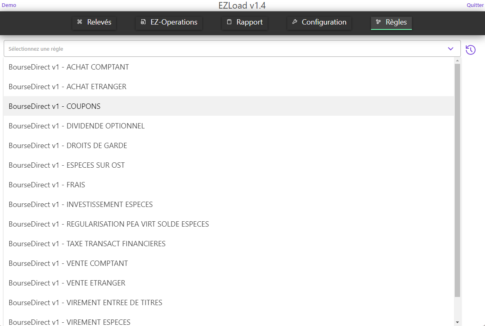
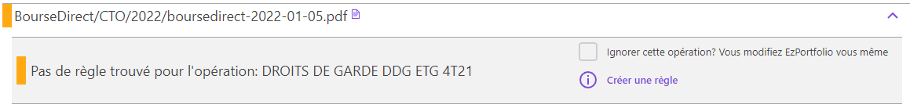

# Les Règles de EZLoad

## Une règle... C'est quoi, une règle?
* A chaque opération de votre relevé d'information correspond une et une seule règle.
* Cette règle va décrire quoi faire dans EZPortfolio lorsqu'un type d'opération est détecté.
* Par exemple, si vous achetez une action, il faut :
  * Créer une opération "Achat titres" dans l'onglet MesOpérations
  * Créer une opération "Frais de courtage" si nécessaire dans l'onglet MesOpérations
  * Créer/Trouver la ligne dans l'onglet MonPortefeuille et lui ajouter le nombre d'actions acheté
  * Trouver la ligne LIQUIDITE dans l'onglet MonPortefeuille et lui soustraire le montant de l'opération
* Une règle exprime tout ça
* Si dans vos relevés d'information, il y a une opération qui n'a pas de règle. Il faut la créer une seule fois, et elle servira à toutes les futures opérations de même type.
* Avec EZLoad, il est même possible de l'envoyer sur un serveur pour que tout le monde puisse en bénéficier
* Et bien sûr une règle ne contient aucune information personnelle. Seul les informations décrivant ce qu'il faut faire sont présentes.

## Voir les règles existantes
* Pour pouvoir voir les règles, il faut activer une option dans EZLoad.
* Elle s'active en allant sur cette url : http://localhost:2180/api/config/set?key=ezLoad.admin.showRules&value=true
* Puis en allant sur l'onglet ***"Règles"***
  * 

## Créer une nouvelle règle
* Lorsque vous avez une opération qui n'a pas de règle associée, si vous avez activé l'onglet des règles, vous pourrez voir ceci :
  * 
* En cliquant sur ***"Créer une règle"*** vous allez pouvoir configurer EZLoad et lui apprendre quoi faire pour ce type d'opération.

